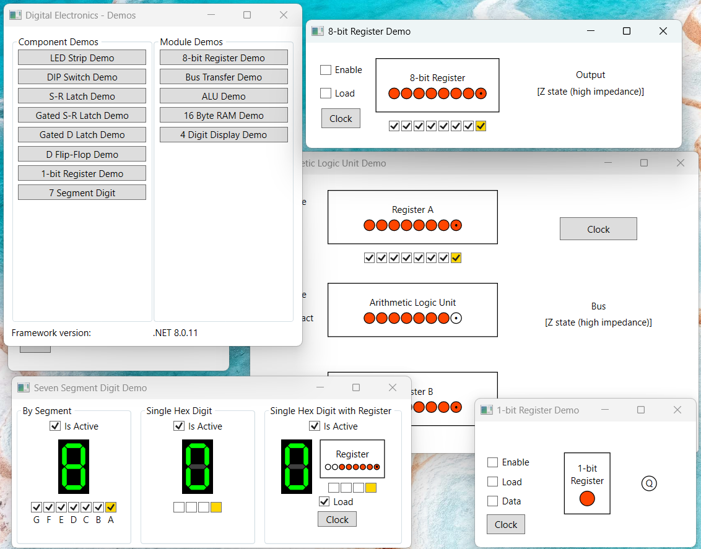
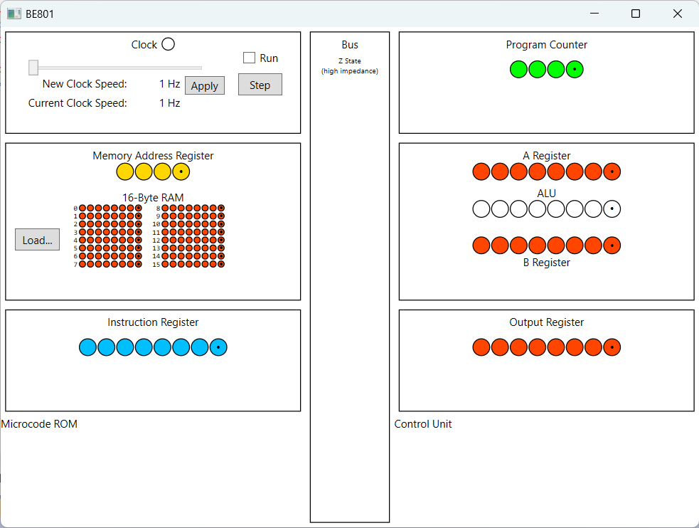

# Ben Eater's 8-bit breadboard computer - in code!

I was watching YouTuber Ben Eater's video series on building an [8-bit breadboard computer](https://youtube.com/playlist?list=PLowKtXNTBypGqImE405J2565dvjafglHU&si=5VQzhQfZGRd30bCy) and wanted to follow along but I wasn't so interested in playing with breadboard and bits of wire.

Instead, I applied what I learnt from watching the videos to create a library for modeling simple digital electronic circuits, coded in C#.

Logic gates form the most basic components, which are used to construct the electronic components that Ben Eater describes in his videos, such as latches and flip-flops. These components are used to construct the high-level modules of a CPU such as the bus, registers, ALU, ROM, RAM and address decoders.

## Component demos

The [DigitalElectronics.Demos project](https://github.com/DanStevens/DigitalElectronics/tree/master/Views/DigitalElectronics.Demos) is an interactive demo a Windows executable that showcases the various components and modules and their WPF controls. They mirror the various breadboard demos featured in Ben Eater's video series. They were helpful in verifying the behaviorial correctness of the components and modules.

Here's a screenshot of the main menu and some of the demo windows:



## BE801 Computer

The BE801 is an 8-bit computer built from [components](https://github.com/DanStevens/DigitalElectronics/tree/master/Models/Components) and [modules](https://github.com/DanStevens/DigitalElectronics/tree/master/Models/Modules) in the solution. It has a WPF UI that mirrors the layout of Ben Eater's breadboard computer. Here's a screenshot of the BE801 in its default state:



There is also a text-based UI for the BE801 that runs a 

### Architecture

  - 4-bit instruction set
  - 4-bit address width
  - 4-bit program counter
  - 2 8-bit registers (A & B)
  - 8-bit Arithmetic Logic Unit
  - 8-bit output register
  - 8-bit internal bus
  - 16-bytes internal RAM

### Programs

There is current no assembler for BE801 instructions, but there are a few very simple hand-coded [sample programs](https://github.com/DanStevens/DigitalElectronics/tree/master/Programs/BE801) included in the repository that can be loaded into the computer:

  - CountUp.bin: Continously counts up be 1
  - ThreeTimesTable.bin: Continously counts up be 3
  - Fibonacci.bin: Outputs the Fibonacci sequence
  - CalculateAnswerToLifeTheUniverseAndEverything.bin: Computes the Answer To Life The Universe and Everything (adds 30 and 12)

### Instruction set

The BE801 instructions consist of a 4-bit opcode and a 4-bit operand that is always a memory address. Execution begins from memory address 0.

```
  - 0x0 NOP: No operation
  - 0x1 LDA: Load A Register from address
  - 0x2 ADD: Arithmetic addition
  - 0x3 SUB: Arithmetic subtraction
  - 0x4 STA: Store A Register to address
  - 0x5 LDI: Load Instruction Register
  - 0x6 ---: Reserved for future use
  - 0x7 ---: Reserved for future use
  - 0x8 ---: Reserved for future use
  - 0x9 ---: Reserved for future use
  - 0xA ---: Reserved for future use
  - 0xB ---: Reserved for future use
  - 0xC ---: Reserved for future use
  - 0xD ---: Reserved for future use
  - 0xE OUT: Update Output Register
  - 0xF HLT: Halt computer
```
